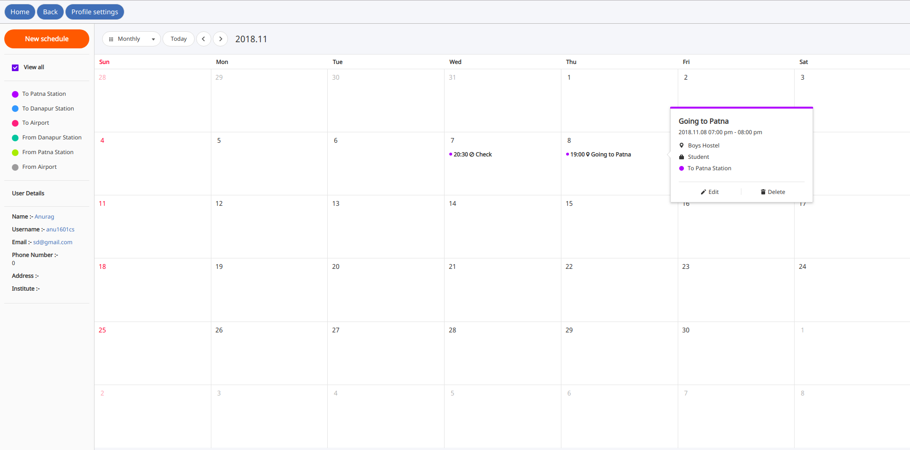
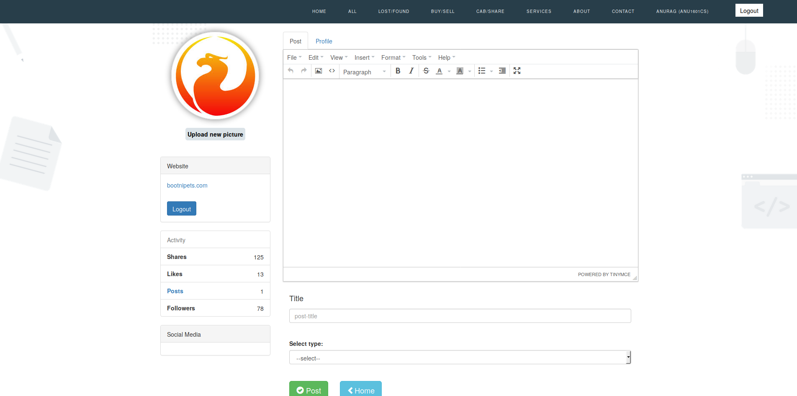
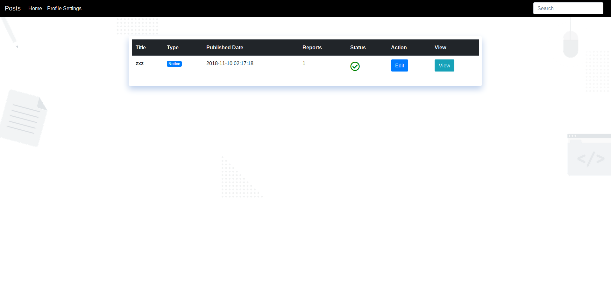
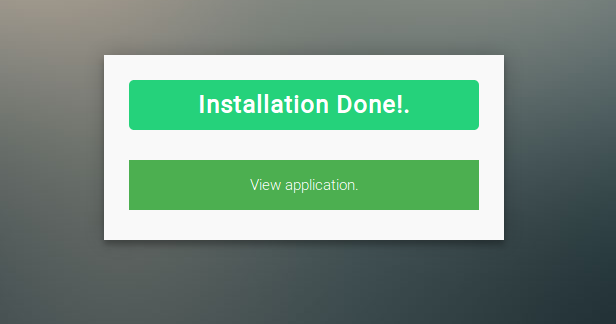
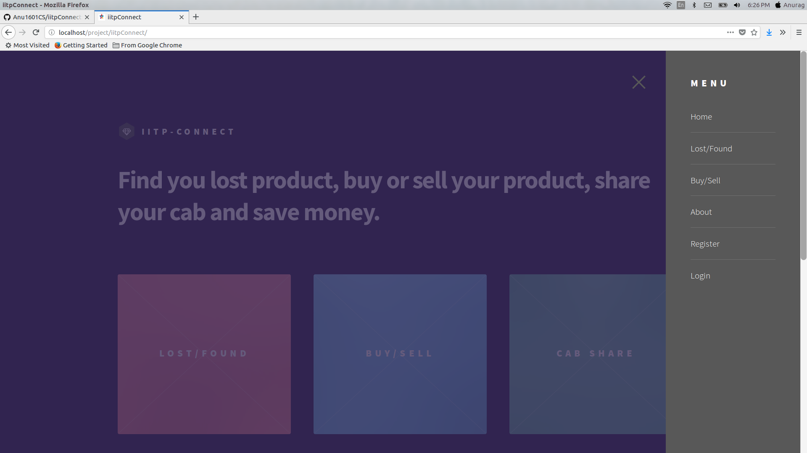
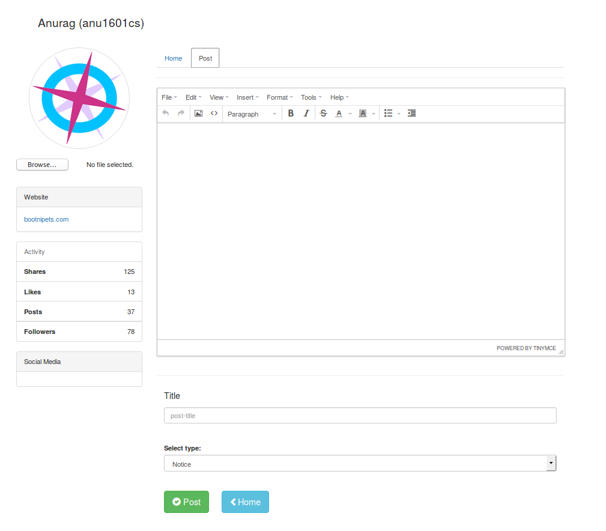

# iitpConnect 
CS354 Project 
 

  

## Language used
1. PHP 7.0, MySQL, Javascript, HTML, CSS 
2. OOPs, ES6, MVC

## Setup
1. PHP 7.0 or above
2. Install any server Xampp or Apache2 etc.
3. Clone this repo to your server folder dir.
4. Change permission of folder to 777 or full permission.
5. Now run this application in browser.
6. Make a install of your application software.
7. Done! Enjoy application.

## mod_rewrite rule configuration
### apache2 configuration
Follow this link <a href="https://www.digitalocean.com/community/tutorials/how-to-rewrite-urls-with-mod_rewrite-for-apache-on-ubuntu-18-04" >Here</a>

## TODO
1. Admin section.
2. Code refactoring.
3. Improve UI.
4. Add more feature in post section.
5. Improve Profile section and information.
 

## CAB SHARE

  

  

## Profile Setting

  

## All user posts

  

## Post section

  

## Home

  

## Login

  

## Register

  

